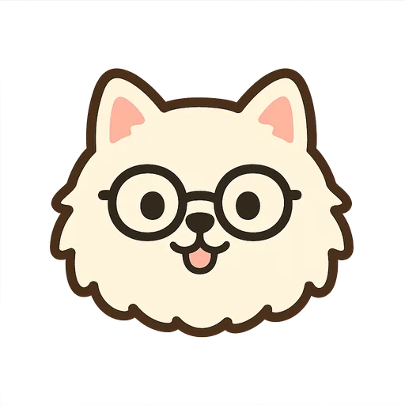
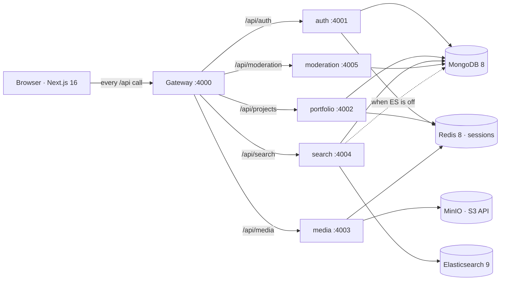
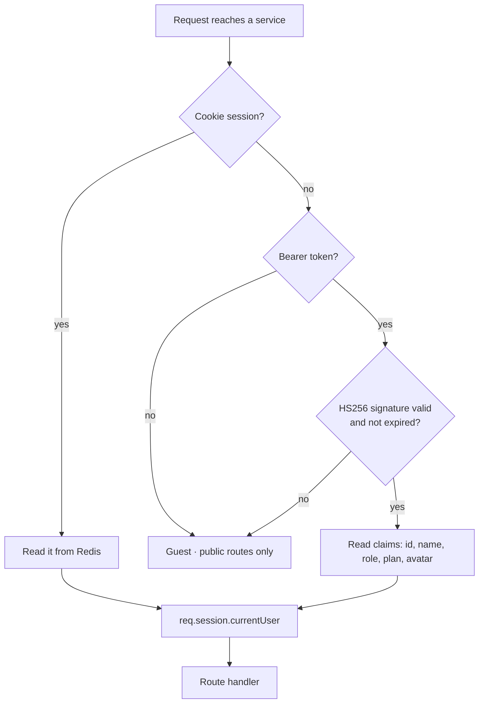
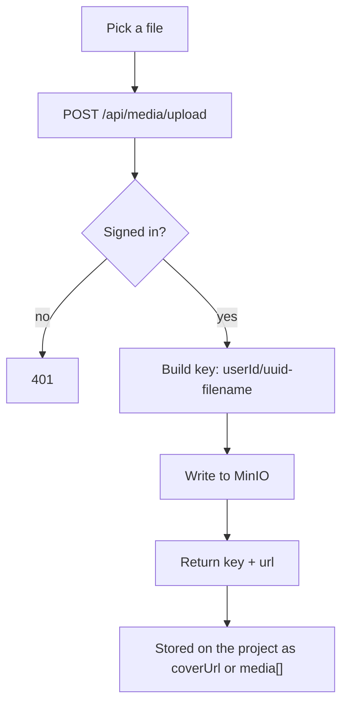
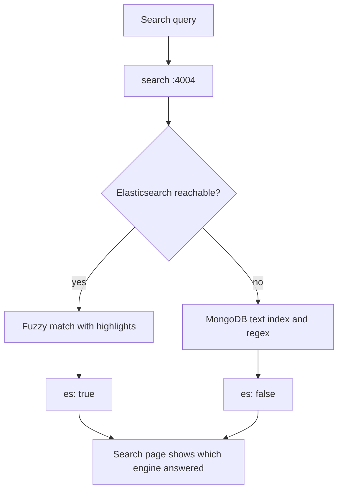
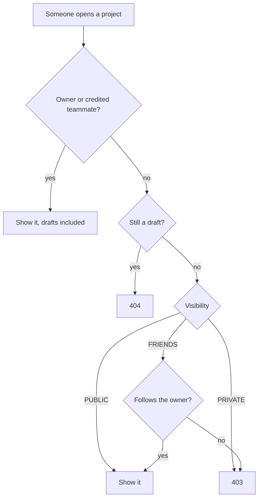

<div align="center">


# PortfolioSpace

**A portfolio and social app for creative people.**
Post your work, follow other makers, chat, and search everything.

<p>
  
  
  
  
  
  
  
  
  
  
  
  
</p>

<div align="center">


</div>
</div>

---

## About

I wanted one place to keep my daily ideas and portfolio, and I wanted it to feel like an app people
actually use, not a static resume page. So PortfolioSpace has two sides:

- **A portfolio.** Every piece of work is a project with a cover, a gallery, tags, a tech stack, and stats.
- **A small social network.** Follow people, like and save work, comment, send messages, post 24-hour
  stories, and scroll a short-video feed.

Still in progress so Everything runs locally with Docker.

<div align="center">

</div>

---

## Tech

| Part |  |  |
| --- | --- | --- |
| Frontend | Next.js 16, React 19, TypeScript, Redux Toolkit | App Router, typed props, one store for the logged-in user |
| Backend | Node 24, Express 5, five services behind a gateway | Each area stays small and easy to read |
| Database | MongoDB 8 with Mongoose | Flexible shapes for very different kinds of work |
| Sessions | Redis 8 | All services read the same login |
| Auth | Cookie session **or** JWT | Browser uses cookies, API clients use a Bearer token |
| Files | MinIO now, AWS S3 later | Same S3 SDK, so I only change env values |
| Search | Elasticsearch 9 | Fuzzy search over work and my own chat messages |
| Docs | OpenAPI 3 at `/api/docs` | Every endpoint in one page |
| Metrics | Prometheus text at `/metrics` | Request counts and timings per service |
| Infra | Docker Compose | One command starts the databases |
| CI/CD | GitHub Actions | Lint, tests, build, and container images |

---
---

## Architecture

The browser only ever talks to the gateway on `:4000`. The gateway forwards each `/api/*` prefix to
the service that owns it, so nothing else is exposed and the client only needs one base URL.



Every service shares one MongoDB and one Redis. Redis is what makes a single login work everywhere:
each service reads the same session store, so a cookie set by auth is understood by portfolio and
media without any service-to-service call.

### layout

```
PortfolioSpace/
  client/                 Next.js app (TypeScript)
  server/
    gateway/              one public door
    services/
      auth-service/       users, follows, notifications, messages, endorsements
      portfolio-service/  projects, comments, boards, saves, stories
      media-service/      uploads and presigned links
      search-service/     Elasticsearch with a MongoDB fallback
      moderation-service/ report queue and admin actions
    scripts/              shared test runner and helpers
  infra/docker-compose.yml
  .github/workflows/      ci.yml and docker.yml
  docs/                   architecture and database notes
```

### request user

Two ways in, one result. Whichever path a request takes, handlers only ever read
`req.session.currentUser`, so no route needs to care which one was used.



### Uploading

The file goes through the media service rather than straight to storage, which is what lets it check
the login and build the key itself. Keys are always prefixed with the uploader's id, and that prefix
is what later proves ownership on delete.



`GET /api/media/view/*key` mints an expiring link for a stored object. Deletes check that the key
starts with your own user id, and reject anything containing `..` so a key cannot climb out of the
uploads folder.

### Search

Elasticsearch is optional. Every search endpoint answers either way and says which engine replied, so
the app never breaks just because the cluster is not running.



### Who is allowed to see a project

This is the check that runs before any project is returned. Credited teammates are treated like the
owner for reading and editing, but only the owner can change the credit list or delete the work.


 
---


## Features

**Work**
- Pick a work type first (art, code, film, photo, music, writing, daily, other), then a matching category
- Cover plus a gallery you can drag to reorder
- Role, year, key features, tech stack, repo link, live demo link
- Public, followers-only, or private, and a draft mode before you publish
- Edit history: the last ten versions are kept and any one can be put back
- Team credits: tag whoever worked on it with you, say what they did, and it shows on their profile too
- Live GitHub repo card with stars, forks, issues, and language

**Social**
- Follow people, like, save, and build boards
- Comments with replies at any depth, emoji reactions, and @mentions with autocomplete
- Instagram-style feed with Following and For You tabs
- Stories that disappear after 24 hours, with poll and question stickers people can answer
- A landscape short-video feed with double-tap to like
- Direct messages with photos, voice notes, stickers, project cards, read receipts, and a typing dot

**Profile**
- Instagram-style grid and stats
- GitHub-style contribution heatmap and pinned work
- LinkedIn-style experience, education, skill endorsements, recommendations, and an open-to-work badge
- Badges worked out from your own numbers, and a list of who looked at your profile
- A Show profile button on the edit page so you can see what other people see

**Search**
- One page that searches work, people, tags, and my own chat messages
- Elasticsearch does the matching, with a MongoDB fallback if the engine is off

**Safety**
- Block someone and you both disappear from each other's feeds, search, profiles and inbox
- Private account: only followers can open your profile and work
- Report anything, and admins work through a queue in the moderation service
- Being credited on a project lets you edit it, but only the person who posted it can change the credit list or delete it
- Crediting someone never leaks a private or draft project onto their profile

**Plans**
- Two plans, Basic and Pro. Every feature works on both.
- Pro only changes upload size and adds a badge. Limits are off unless I set `BASIC_PROJECT_LIMIT`.

**Extras**
- Dark mode
- Keyboard shortcuts on Discover: `j` `k` to move, `l` to like, `Enter` to open, `?` for help
- Discover keeps loading as you scroll instead of dumping everything at once
- Analytics with a real day-by-day trend line
- Admin page for reports

---

## Locally

Node 20 or newer and Docker Desktop.


```bash
git clone https://github.com/vickyliuwt/PortfolioSpace.git
cd PortfolioSpace

# root, server, client
npm run install:all

# mongo + redis + minio
npm run infra:up

# demo users and work
npm run seed

# all services + the client
npm run dev
```

Open http://localhost:3000.

Demo login: **vicky / paw12345**

### Turn on search

Elasticsearch is heavy, so it sits in its own Docker profile. The app works without it (search falls
back to MongoDB), and the Search page tells you which engine answered.

```bash
# same infra plus elasticsearch on :9200
npm run infra:up:search
npm run dev
```

The search service builds its index when it starts. To rebuild it later, sign in as an admin and
POST to `/api/search/reindex`.

### Ports

| Thing | Port |
| --- | --- |
| Client | 3000 |
| Gateway | 4000 |
| Auth / Portfolio / Media / Search / Moderation | 4001 / 4002 / 4003 / 4004 / 4005 |
| MongoDB | 27017 |
| Redis | 6379 |
| MinIO API / console | 9000 / 9001 |
| Elasticsearch | 9200 |
| Mongo GUI / Redis GUI | 8081 / 8082 |

### Scripts

| Command | What it does |
| --- | --- |
| `npm run dev` | Client and all services together |
| `npm run infra:up` | Start the databases |
| `npm run infra:up:search` | Start the databases plus Elasticsearch |
| `npm run infra:down` | Stop the containers |
| `npm run infra:reset` | Stop and delete the volumes (wipes data) |
| `npm run seed` | Add demo users and work, or fill in new fields if you already have data |
| `npm test` | Server and client tests |
| `npm run docker:up` | Everything in containers instead of npm |

If the client acts strange after I pull new code, I delete `client/.next` and start again.

---

## Two ways to log in

The browser signs in normally and gets a cookie session stored in Redis.

For API clients there is a JWT. Sign in, or call `POST /api/auth/token` while signed in, and use the
token as a header. The token is HS256 and signed with `JWT_SECRET`.

```bash
curl -s -X POST http://localhost:4000/api/auth/signin \
  -H "Content-Type: application/json" \
  -d '{"username":"vicky","password":"paw12345"}'
# -> { ...user, "token": "eyJ..." }

curl -s http://localhost:4000/api/projects/mine \
  -H "Authorization: Bearer <token>"
```

Both paths land on the same `req.session.currentUser`, so every route works either way.

---

## Storage: MinIO now, S3 later

Uploads go through the media service and come back as presigned links, so files stream straight from
storage. MinIO speaks the S3 API, so moving to AWS is only an env change.

```env
S3_ENDPOINT=http://127.0.0.1:9000     # remove this line for real AWS
S3_REGION=us-east-1
S3_BUCKET=portfoliospace
S3_ACCESS_KEY=minioadmin
S3_SECRET_KEY=minioadmin
S3_FORCE_PATH_STYLE=true              # false on AWS
```

---

## Search notes

The search service talks to Elasticsearch over plain HTTP, so there is no extra client library.

- `GET /api/search/projects?q=&kind=&category=` public work, fuzzy, with highlights
- `GET /api/search/messages?q=` only messages I sent or received
- `GET /api/search/suggest?q=` quick title suggestions
- `POST /api/search/reindex` admin only, rebuilds both indexes
- `GET /api/search/health` shows whether the engine is up

If Elasticsearch is off, every endpoint answers `{ es: false }` and the client quietly uses the
MongoDB query instead. Nothing breaks.

---

## API reference

The gateway serves the whole API in one page.

- http://localhost:4000/api/docs - Swagger UI, try any endpoint from the browser
- http://localhost:4000/api/openapi.json - the raw spec

## Health and metrics

| Endpoint | What you get |
| --- | --- |
| `GET /api/health` | every service, up or down, in one answer |
| `GET /api/metrics` | request counts, error counts and average times for all services |
| `GET /metrics` | Prometheus text on the gateway and on each service |

Each service also prints one JSON log line per request, so the output pipes into anything that reads
JSON.

## Tests

```bash
# server and client
npm test

npm --prefix server run test:coverage
npm --prefix client run test:coverage
```


```bash
npm run infra:up
npm test
```


```bash
npm run test:reset-mongo
npm test
```

You can point the tests at a different server with `MONGO_TEST_URL`.

cover:
signup and sign in, JWT vs cookie auth, follows, endorsements, recommendations, messages including
unsend rules, profile visits, team credits and who may edit shared work, the report queue and the admin
gate on takedowns, and who can see private work, drafts and followers-only work. The client tests cover
the badge rules, mention rendering and the small format helpers.

Coverage has a floor in the config, and CI fails if it drops below it.

## CI/CD

`.github/workflows/ci.yml` runs on every push and pull request:

1. **Lint** the client
2. **Server tests** on Node 22 and 24, with MongoDB, Redis, and Elasticsearch as service containers,
   plus a syntax check on every backend file
3. **Client tests**
4. **Build** the client, only after the first three pass

`.github/workflows/docker.yml` builds a container image for each service and the client. Both
Dockerfiles are multi-stage: install, build, then a small runtime image that runs as a non-root user.

---

## Env files

Copy the examples and edit if you want. The defaults already work for local dev.

```bash
cp .env.example server/.env
cp client/.env.local.example client/.env.local
```

Useful values:

```env
MONGO_URL=mongodb://127.0.0.1:27017/portfoliospace
REDIS_URL=redis://127.0.0.1:6379
ES_URL=http://127.0.0.1:9200
SESSION_SECRET=change_me
JWT_SECRET=change_me_too
NEXT_PUBLIC_API_URL=http://localhost:4000/api
```

---

## How I worked on it

I built this in short cycles, one small feature at a time: pick the next thing, write the API,
wire the screen, test it by hand, then commit. Bigger pieces like stories, messages, and search each
got their own round so I could keep the parts small. Tests and the GitHub Actions run keep me honest
when I change something old.


---

<div align="center">
<br>

<br>
<sub>built with 🐾 by Weiting (Vicky) Liu </sub>
</div>
